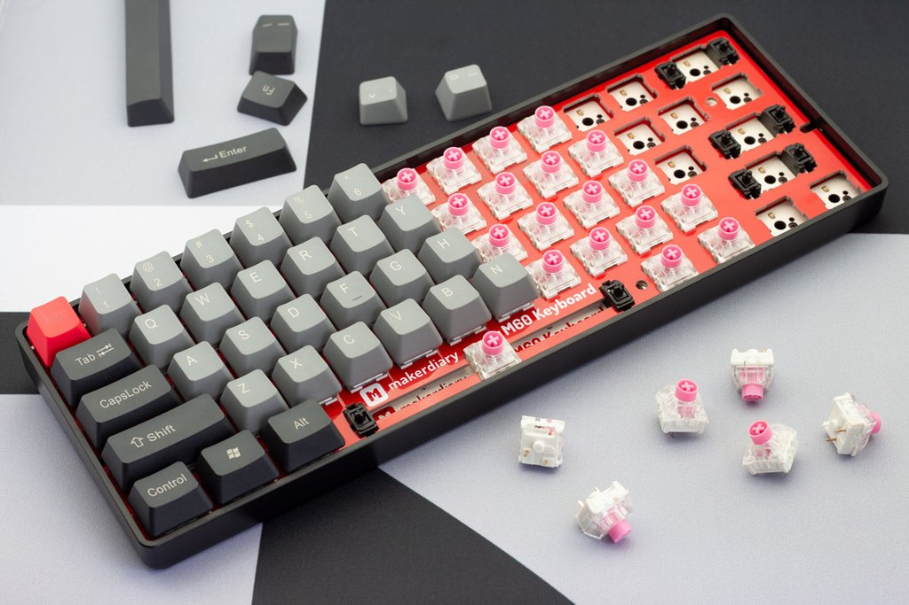

Python Keyboard
===============

 English | [中文][1]
---------|----------

From a hand-wired USB & Bluetooth keyboard powered by Python to production.

The Python keyboard works so well thanks to MicroPython and CircuitPython.


## Hand-wiring a keyboard
Follow [the guide - hand-wiring-a-keyboard.md](hand-wiring-a-keyboard.md) to rapidly make a keyboard with 100 lines of Python code.


## From prototype to production <sup><kbd>in progress</kbd></sup>
With putting more time into the Python keyboard, we find it more and more interesting. We think a Python keyboard can make a big difference, so we decide to design a new keyboard for everyone. Check out [the M60 mechanical keyboard](https://makerdiary.com/m60).

[](https://makerdiary.com/m60)

## To be a productive keyboard
As the 60% keyboard lacks a lot of keys (F1~F12, arrow keys and etc). We can add
[features like TMK's layers and composite keys](https://github.com/tmk/tmk_keyboard/blob/master/tmk_core/doc/keymap.md) to make the small keyboard much more powerful.
With the idea of [Toward a more useful keyboard](https://github.com/jasonrudolph/keyboard) to keep our fingers at the home row, we can optimize the keyboard to make us more productive.

Adding the Tap-key feature, which is holding a key down to activate an alternate function, can make a big difference.

### Using <kbd>D</kbd> for Navigation

Taping <kbd>d</kbd> outputs <kbd>d</kbd> (press & release quickly), holding <kbd>d</kbd> down activates navigation functions.


+ <kbd>d</kbd> + <kbd>h</kbd> as <kbd>←</kbd>
+ <kbd>d</kbd> + <kbd>j</kbd> as <kbd>↓</kbd>
+ <kbd>d</kbd> + <kbd>k</kbd> as <kbd>↑</kbd>
+ <kbd>d</kbd> + <kbd>l</kbd> as <kbd>→</kbd>
+ <kbd>d</kbd> + <kbd>u</kbd> as <kbd>PageUp</kbd>
+ <kbd>d</kbd> + <kbd>n</kbd> as <kbd>PageDown</kbd>


To apply the feature, change `code.py` to:

```python
# code.py

from keyboard import *


keyboard = Keyboard()

___ = TRANSPARENT
L1D = LAYER_TAP(1, D)           # Holding D down to activate the layer #1

keyboard.keymap = (
    # layer #0
    (
        ESC,   1,   2,   3,   4,   5,   6,   7,   8,   9,   0, '-', '=', BACKSPACE,
        TAB,   Q,   W,   E,   R,   T,   Y,   U,   I,   O,   P, '[', ']', '|',
        CAPS,  A,   S, L1D,   F,   G,   H,   J,   K,   L, ';', '"',    ENTER,
        LSHIFT,Z,   X,   C,   V,   B,   N,   M, ',', '.', '/',        RSHIFT,
        LCTRL, LGUI, LALT,          SPACE,            RALT, MENU,  L1, RCTRL
    ),

    # layer #1
    (
        '`',  F1,  F2,  F3,  F4,  F5,  F6,  F7,  F8,  F9, F10, F11, F12, DEL,
        ___, ___, ___, ___, ___, ___, ___,PGUP, ___, ___, ___, ___, ___, ___,
        ___, ___, ___, ___, ___, ___,LEFT,DOWN, UP,RIGHT, ___, ___,      ___,
        ___, ___, ___, ___, ___, ___,PGDN, ___, ___, ___, ___,           ___,
        ___, ___, ___,                ___,               ___, ___, ___,  ___
    ),
)

keyboard.run()
```

### Using <kbd>;</kbd> as <kbd>Ctrl</kbd>
Use <kbd>;</kbd> as a MODS_TAP key, taping <kbd>;</kbd> outputs <kbd>;</kbd>, holding <kbd>;</kbd> down outputs <kbd>Ctrl</kbd>. To enable it, change the keymap to:

```python
# code.py
from keyboard import *


keyboard = Keyboard()

___ = TRANSPARENT
L1D = LAYER_TAP(1, D)               # D as a LAYER_TAP key

# Semicolon & Ctrl
SCC = MODS_TAP(MODS(RCTRL), ';')    # ; as a MODS_TAP key

keyboard.keymap = (
    # layer #0
    (
        ESC,   1,   2,   3,   4,   5,   6,   7,   8,   9,   0, '-', '=', BACKSPACE,
        TAB,   Q,   W,   E,   R,   T,   Y,   U,   I,   O,   P, '[', ']', '|',
        CAPS,  A,   S, L2D,   F,   G,   H,   J,   K,   L, SCC, '"',    ENTER,
        LSHIFT,Z,   X,   C,   V,   B,   N,   M, ',', '.', '/',        RSHIFT,
        LCTRL, LGUI, LALT,          SPACE,            RALT, MENU,  L1, RCTRL
    ),

    # layer #1
    (
        '`',  F1,  F2,  F3,  F4,  F5,  F6,  F7,  F8,  F9, F10, F11, F12, DEL,
        ___, ___, ___, ___, ___, ___, ___,PGUP, ___, ___, ___, ___, ___, ___,
        ___, ___, ___, ___, ___, ___,LEFT,DOWN, UP,RIGHT, ___, ___,      ___,
        ___, ___, ___, ___, ___, ___,PGDN, ___, ___, ___, ___,           ___,
        ___, ___, ___,                ___,               ___, ___, ___,  ___
    ),
)

keyboard.run()
```

### Using Pair-keys
Simultaneously pressing two keys (interval less than 25ms) activates an alternate function.

```python
def pairs_handler(dev, n):
    dev.send_text('You just trigger No.{} pair keys'.format(n))

keyboard.pairs_handler = pairs_handler

# Map key to number
#
# ESC   1   2   3   4   5   6   7   8   9   0   -   =  BACKSPACE
# TAB   Q   W   E   R   T   Y   U   I   O   P   [   ]   |
# CAPS  A   S   D   F   G   H   J   K   L   ;   "      ENTER
#LSHIFT Z   X   C   V   B   N   M   ,   .   /         RSHIFT
# LCTRL LGUI LALT          SPACE         RALT MENU  L1 RCTRL
#
#   0,  1,  2,  3,  4,  5,  6,  7,  8,  9, 10, 11, 12, 13,
#   27,26, 25, 24, 23, 22, 21, 20, 19, 18, 17, 16, 15, 14,
#   28,29, 30, 31, 32, 33, 34, 35, 36, 37, 38, 39,     40,
#   52,51, 50, 49, 48, 47, 46, 45, 44, 43, 42,         41,
#   53,  54,  55,            56,           57, 58, 59, 60

# Pairs: J & K
keyboard.pairs = [{35, 36}]

keyboard.run()
```

### Optimizing with C modules<sup><kbd>in progress</kbd></sup>

A C module `matrix` of keyboard matrix is written to reduce latency and improve power efficiency. The module has the same function as [`keyboard/matrix.py`](keyboard/matrix.py).

The module is included in the latest firmware in `firmware/`. If you are interested, you can build it from [circuitpython/tree/m60](https://github.com/xiongyihui/circuitpython/tree/m60).


## Todo
- [x] add macro
- [x] add cosumer keys
- [X] add RGB backlight
- [ ] add system keys
- [ ] add mouse keys


## Credits
+ [MicroPython](https://github.com/micropython/micropython)
+ [CircuitPython](https://github.com/adafruit/circuitpython)


[1]: https://gitee.com/makerdiary/python-keyboard
