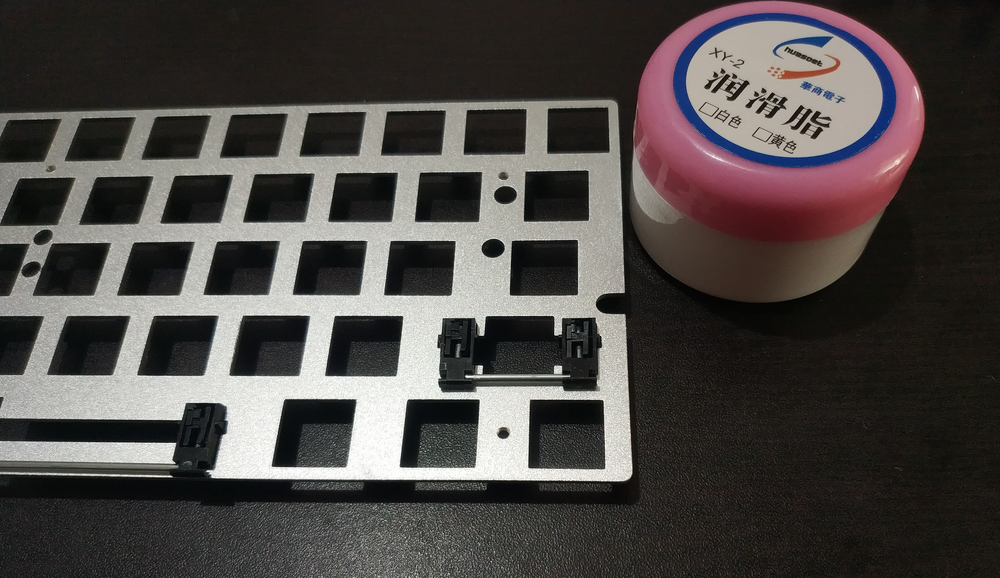
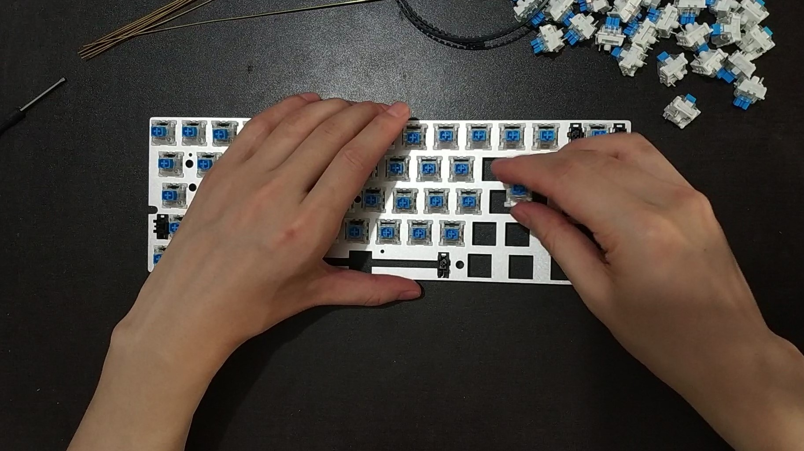

Hand-wiring a keyboard
======================


## Build Hardware


### Materials

+ 0.8mm brass wire
+ 61+ mechanical switches
+ keybaord plate
+ plate mount stabilizers
+ 61+ diodes for anti-ghost
+ [Pitaya Go](https://github.com/makerdiary/pitaya-go)

### Tools

+ soldering iron
+ solder alloy
+ tweezer
+ multimeter

1.  Install Stabilizers

    At first, we should install stabilizers into the keyboard plate. To make the keyboard less noisy, we can lubricate the stabilizers with grease.

    

2.  Mount Switches

    Mount the mechanical switches to the plate.

    

3.  Solder Keyboard Matrix

    The keyboard matrix has 5 rows and 14 columns, each switch has two pins to connect to a row and a column. First, use a brass wire as a row and solder it with a diode. Second, solder the diode with a switch's row pin. After soldering all rows, we put something as a spacer on top of the row wires, and then solder the column wires with the column pins of these switches. By removing the spacer, the rows and columns are crossed in 3D space and are avoid to be shorted.  We'd better use a muiltmeter to check if rows and columns are shorted and each diode's direction is correct.

    

    

    

4.  Connect Keyboard Matrix to Pitaya Go

    Connect each row and each column to an IO of the board Pitaya Go. When ardware is ready now, check if rows and columns are shorted before power on.

    

## Setup Python

1.  Follow [the guide - How to Program Pitaya Go](https://wiki.makerdiary.com/pitaya-go/programming/) to flash [CircuitPython firmware](https://github.com/makerdiary/python-keyboard/blob/master/circuitpython-5.3.0-for-pitaya-go.hex)
2.  Download two CircuitPython libraries - [adafruit-ble](https://github.com/adafruit/Adafruit_CircuitPython_BLE) & [adafruit-hid](https://github.com/adafruit/Adafruit_CircuitPython_HID) and put them into the `lib` directory of the USB drive named CIRCUITPY.

    ```
    CIRCUITPY
    ├───code.py
    └───lib
        ├───adafruit_ble
        └───adafruit_hid
    ```

3.  Copy the Python code to `code.py`. When `code.py` is reloaded, you will get a keyboard with USB & Bluetooth


    ```python
    import time
    from board import *
    import digitalio
    import usb_hid

    import adafruit_ble
    from adafruit_ble.advertising import Advertisement
    from adafruit_ble.advertising.standard import ProvideServicesAdvertisement
    from adafruit_ble.services.standard.hid import HIDService
    from adafruit_hid.keyboard import Keyboard
    from adafruit_hid.keycode import Keycode as _

    ROWS = (P27, P13, P30, P20, P3)
    COLS = (P26, P31, P29, P28, P5, P4, P24, P25, P23, P22, P14, P15, P16, P17)

    KEYMAP = (_.ESCAPE, _.ONE, _.TWO, _.THREE, _.FOUR, _.FIVE, _.SIX, _.SEVEN, _.EIGHT, _.NINE, _.ZERO, _.MINUS, _.EQUALS, _.BACKSPACE,
            _.TAB, _.Q, _.W, _.E, _.R, _.T, _.Y, _.U, _.I, _.O, _.P, _.LEFT_BRACKET, _.RIGHT_BRACKET, _.BACKSLASH,
            _.CAPS_LOCK, _.A, _.S, _.D, _.F, _.G, _.H, _.J, _.K, _.L, _.SEMICOLON, _.QUOTE, None, _.ENTER,
            _.LEFT_SHIFT, _.Z, _.X, _.C, _.V, _.B, _.N, _.M, _.COMMA, _.PERIOD, _.FORWARD_SLASH, None, _.RIGHT_SHIFT, None,
            _.LEFT_CONTROL, _.LEFT_ALT, _.LEFT_GUI, None, None, _.SPACE, None, None, _.RIGHT_ALT, _.RIGHT_GUI, _.APPLICATION, _.RIGHT_CONTROL, None, None)

    class Matrix:
        def __init__(self, rows=ROWS, cols=COLS):
            self.rows = []
            for pin in rows:
                io = digitalio.DigitalInOut(pin)
                io.direction = digitalio.Direction.OUTPUT
                io.drive_mode = digitalio.DriveMode.PUSH_PULL
                io.value = 0
                self.rows.append(io)
            self.cols = []
            for pin in cols:
                io = digitalio.DigitalInOut(pin)
                io.direction = digitalio.Direction.INPUT
                io.pull = digitalio.Pull.DOWN
                self.cols.append(io)
            self.pressed_keys = []

        def scan(self):
            new_keys = []
            pressed_keys = []
            released_keys = self.pressed_keys
            for r in range(len(self.rows)):
                self.rows[r].value = 1
                for c in range(len(self.cols)):
                    if self.cols[c].value:
                        key = r * len(self.cols) + c
                        pressed_keys.append(key)
                        if key in released_keys:
                            released_keys.remove(key)
                        else:
                            new_keys.append(key)
                self.rows[r].value = 0
            self.pressed_keys = pressed_keys
            return pressed_keys, released_keys, new_keys

    def main():
        hid = HIDService()
        advertisement = ProvideServicesAdvertisement(hid)
        advertisement.appearance = 961
        ble = adafruit_ble.BLERadio()
        if ble.connected:
            for c in ble.connections:
                c.disconnect()
        ble.start_advertising(advertisement)
        advertising = True
        ble_keyboard = Keyboard(hid.devices)

        matrix = Matrix()
        usb_keyboard = Keyboard(usb_hid.devices)

        while True:
            pressed_keys, released_keys, new_keys = matrix.scan()
            if released_keys:
                released_keycodes = list(map(lambda i: KEYMAP[i], released_keys))
                print('released keys {}'.format(released_keycodes))

                usb_keyboard.release(*released_keycodes)
                if ble.connected:
                    advertising = False
                    ble_keyboard.release(*released_keycodes)
            if new_keys:
                new_keycodes = list(map(lambda i: KEYMAP[i], new_keys))
                print('new keys {}'.format(new_keycodes))
                usb_keyboard.press(*new_keycodes)
                if ble.connected:
                    advertising = False
                    ble_keyboard.press(*new_keycodes)

            if not ble.connected and not advertising:
                ble.start_advertising(advertisement)
                advertising = True

            # time.sleep(0.001)

    if __name__ == '__main__':
        main()
    ```

    If you have a different configuration of raws and columns, you must change `ROWS` and `COLS` in the code.

